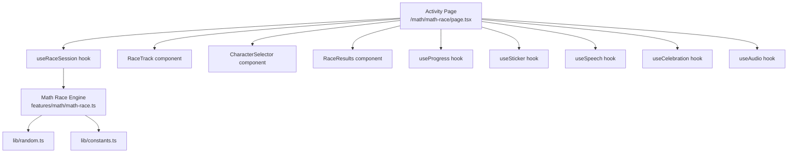
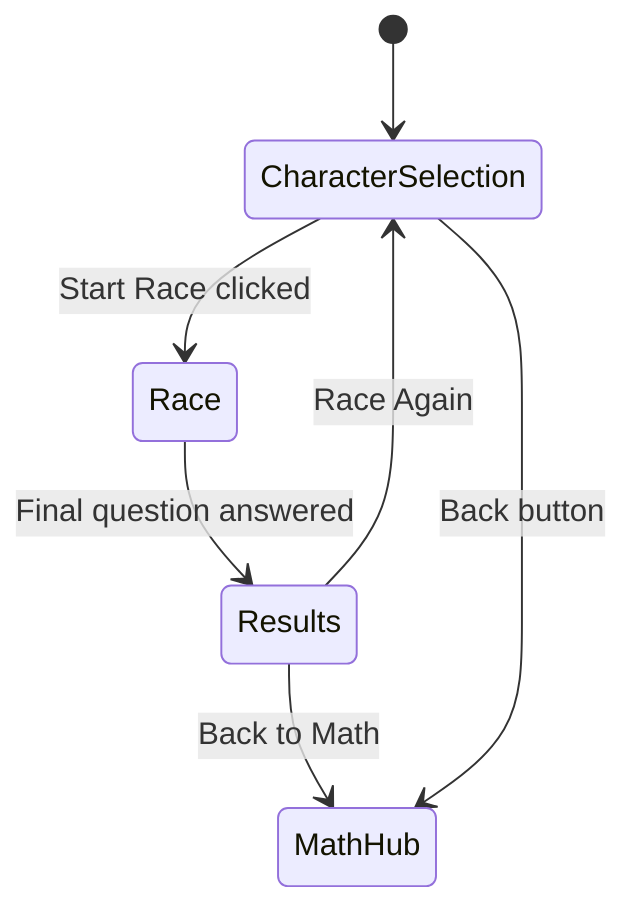

# Design Document: Math Race

## Overview

Math Race is an arithmetic activity for the kids' learning app that gamifies addition and subtraction practice through an animated swimming race. The child picks a character (duck, panda, or rabbit), then answers a series of math questions. Each correct answer advances their character along a horizontal race track. At the end of the session, the child's accuracy determines their race placement (1st, 2nd, or 3rd), which in turn determines how many stickers they earn.

The feature integrates into the existing math activities hub at `/math/math-race` and reuses existing hooks (`useProgress`, `useSticker`, `useSpeech`, `useCelebration`, `useAudio`) and UI components (`ActivityShell`, `CelebrationOverlay`, `AnswerOption`) where possible. New logic lives in a `Math_Race_Engine` module responsible for question generation, race state management, opponent simulation, and placement calculation.

## Architecture

The feature follows the existing page → hook → feature-module layered architecture:



**Screen flow:**



**Key architectural decisions:**

1. **Separate `useRaceSession` hook** rather than reusing `useActivitySession` — the race needs first-attempt tracking, opponent state management, and placement calculation that don't fit the existing generic session hook.
2. **Engine as pure functions** — `math-race.ts` exports pure functions for question generation, distractor generation, placement calculation, opponent position calculation, and sticker count determination. This keeps logic testable without UI dependencies.
3. **CSS transitions for animation** — character movement uses CSS `transform: translateX()` with `transition` properties, respecting `prefers-reduced-motion`.

## Components and Interfaces

### New Files

| File | Purpose |
|------|---------|
| `features/math/math-race.ts` | Math Race Engine — pure logic functions |
| `hooks/useRaceSession.ts` | Race-specific session management hook |
| `components/activity/CharacterSelector.tsx` | Character selection UI |
| `components/activity/RaceTrack.tsx` | Race track with animated characters |
| `components/activity/RaceResults.tsx` | Results screen with podium |
| `app/math/math-race/page.tsx` | Activity page orchestrating the flow |

### Math Race Engine API (`features/math/math-race.ts`)

```typescript
/** Race character identifiers */
export type RaceCharacter = 'duck' | 'panda' | 'rabbit';

/** A math race question */
export interface RaceQuestion {
  id: string;
  operand1: number;
  operand2: number;
  operation: 'addition' | 'subtraction';
  correctAnswer: number;
  options: AnswerOption[];
  correctOptionId: string;
  speechText: string;
}

/** Placement result */
export type Placement = 1 | 2 | 3;

/** Generate a batch of race questions for a session */
export function generateRaceQuestions(count: number): RaceQuestion[];

/** Generate a single race question */
export function generateRaceQuestion(): RaceQuestion;

/** Generate distractor values for a given correct answer */
export function generateRaceDistractors(correctAnswer: number, count: number): number[];

/** Calculate placement from accuracy percentage */
export function calculatePlacement(accuracyPercent: number): Placement;

/** Calculate sticker count from placement */
export function calculateStickerReward(placement: Placement): number;

/** Calculate opponent final positions based on player accuracy */
export function calculateOpponentPositions(
  playerAccuracy: number,
  questionsTotal: number
): { opponent1: number; opponent2: number };

/** Calculate player position increment per correct answer */
export function getPlayerIncrement(questionsTotal: number): number;

```

### useRaceSession Hook API (`hooks/useRaceSession.ts`)

```typescript
export interface RaceState {
  phase: 'character-select' | 'racing' | 'results';
  selectedCharacter: RaceCharacter | null;
  questions: RaceQuestion[];
  currentQuestionIndex: number;
  firstAttemptResults: boolean[]; // true = correct on first attempt
  playerPosition: number;        // 0–100 percentage
  opponent1Position: number;     // 0–100 percentage
  opponent2Position: number;     // 0–100 percentage
  placement: Placement | null;
  stickersEarned: number;
}

export interface UseRaceSessionReturn {
  state: RaceState;
  selectCharacter: (character: RaceCharacter) => void;
  startRace: () => void;
  submitAnswer: (optionId: string) => { correct: boolean; firstAttempt: boolean };
  advanceToNextQuestion: () => void;
  reset: () => void;
  accuracyPercent: number;
  isFirstAttempt: boolean; // whether current question hasn't had an incorrect attempt
}
```

### CharacterSelector Component

```typescript
interface CharacterSelectorProps {
  selectedCharacter: RaceCharacter | null;
  onSelect: (character: RaceCharacter) => void;
  onStartRace: () => void;
}
```

Renders 3 tappable character cards (48×48px minimum touch target) with emoji, label, and aria-label. Highlights selected character with scale/border effect. Start Race button is disabled until a character is selected.

### RaceTrack Component

```typescript
interface RaceTrackProps {
  playerCharacter: RaceCharacter;
  playerPosition: number;
  opponent1Character: RaceCharacter;
  opponent1Position: number;
  opponent2Character: RaceCharacter;
  opponent2Position: number;
  reducedMotion: boolean;
}
```

Renders a horizontal 3-lane track with swimming theme (blue gradient). Each character is positioned via `translateX` percentage. Start and finish lines are visually marked. Respects `prefers-reduced-motion`.

### RaceResults Component

```typescript
interface RaceResultsProps {
  playerCharacter: RaceCharacter;
  placement: Placement;
  accuracyPercent: number;
  stickersEarned: number;
  allCharacters: RaceCharacter[];
  onRaceAgain: () => void;
  onBackToMath: () => void;
}
```

Displays podium with 3 characters positioned by placement, accuracy percentage, sticker count, encouragement message, and navigation buttons.

## Data Models

### Race Question

```typescript
interface RaceQuestion {
  id: string;                              // Unique identifier
  operand1: number;                        // 1–10
  operand2: number;                        // 1–10
  operation: 'addition' | 'subtraction';   // Random per question
  correctAnswer: number;                   // 0–20
  options: AnswerOption[];                 // 4 options (reuses existing type)
  correctOptionId: string;                 // ID of correct option
  speechText: string;                      // "What is X plus/minus Y?"
}
```

**Constraints:**
- `operand1` and `operand2` ∈ [1, 10]
- `correctAnswer` ∈ [0, 20]
- For subtraction: `operand1 >= operand2` (to keep result ≥ 0)
- `options` has exactly 4 elements, all distinct values
- Distractors within ±3 of correct answer, clamped to [0, 20]

### Race State

```typescript
interface RaceState {
  phase: 'character-select' | 'racing' | 'results';
  selectedCharacter: RaceCharacter | null;
  questions: RaceQuestion[];
  currentQuestionIndex: number;
  firstAttemptResults: boolean[];
  playerPosition: number;
  opponent1Position: number;
  opponent2Position: number;
  placement: Placement | null;
  stickersEarned: number;
}
```

### Placement Rules

| Accuracy | Placement | Stickers |
|----------|-----------|----------|
| ≥ 75%   | 1st       | 3        |
| 50–74%  | 2nd       | 1        |
| < 50%   | 3rd       | 0        |

### Type Extension

The `ActivityType` union in `types/activity.ts` must be extended with `'math-race'`.

### Constants (added to `lib/constants.ts`)

```typescript
/** Race characters with their emoji and label */
export const RACE_CHARACTERS = [
  { id: 'duck', emoji: '🦆', label: 'Duck' },
  { id: 'panda', emoji: '🐼', label: 'Panda' },
  { id: 'rabbit', emoji: '🐰', label: 'Rabbit' },
] as const;

/** Placement thresholds */
export const PLACEMENT_THRESHOLDS = {
  FIRST: 75,  // >= 75% accuracy
  SECOND: 50, // >= 50% accuracy
} as const;

/** Sticker rewards per placement */
export const PLACEMENT_STICKER_REWARDS: Record<Placement, number> = {
  1: 3,
  2: 1,
  3: 0,
};

/** Celebration duration in ms */
export const CELEBRATION_DURATION_MS = 2500;

/** Opponent position cap before final question */
export const OPPONENT_POSITION_CAP = 95;
```


## Correctness Properties

*A property is a characteristic or behavior that should hold true across all valid executions of a system — essentially, a formal statement about what the system should do. Properties serve as the bridge between human-readable specifications and machine-verifiable correctness guarantees.*

### Property 1: Generated questions have valid operands, result, and operation

*For any* generated race question, the operands shall each be integers in [1, 10], the operation shall be either 'addition' or 'subtraction', and the correct answer shall be an integer in [0, 20] consistent with applying the operation to the operands.

**Validates: Requirements 2.1, 2.5**

### Property 2: Generated questions have exactly 4 unique options with distractors in valid range

*For any* generated race question, there shall be exactly 4 answer options with all distinct values, exactly one option matching the correct answer, and all distractor values shall be integers in [0, 20] within a range derived from ±3 of the correct answer (possibly expanded for edge values).

**Validates: Requirements 2.2, 2.3, 2.6**

### Property 3: Batch generation produces the correct number of questions

*For any* call to generateRaceQuestions(QUESTIONS_PER_SESSION), the returned array shall have exactly QUESTIONS_PER_SESSION elements, each satisfying Properties 1 and 2.

**Validates: Requirements 2.4**

### Property 4: Placement calculation maps accuracy to correct tier

*For any* accuracy percentage in [0, 100], calculatePlacement shall return 1 if accuracy ≥ 75, 2 if 50 ≤ accuracy < 75, and 3 if accuracy < 50.

**Validates: Requirements 5.2, 5.3, 5.4**

### Property 5: Sticker reward matches placement

*For any* placement value (1, 2, or 3), calculateStickerReward shall return 3 for 1st place, 1 for 2nd place, and 0 for 3rd place.

**Validates: Requirements 5.6, 6.1, 6.2, 6.3**

### Property 6: Player position advances on correct answer and is unchanged on incorrect answer

*For any* race state and answer submission, if the answer is correct then the player position shall increase by exactly 100/QUESTIONS_PER_SESSION percentage points, and if the answer is incorrect then the player position shall remain unchanged.

**Validates: Requirements 3.1, 3.3**

### Property 7: Opponent final positions satisfy placement tier constraints

*For any* accuracy percentage determining a placement tier, the calculated opponent final positions shall satisfy: for 1st place (≥75%), both opponents finish below the player; for 2nd place (50–74%), exactly one opponent finishes above and one below the player; for 3rd place (<50%), both opponents finish above the player.

**Validates: Requirements 3.5**

### Property 8: Position bounds invariant

*For any* race state at any point during a session, all character positions (player and opponents) shall be in [0, 100], and for any question that is not the final question, opponent positions shall not exceed 95%.

**Validates: Requirements 3.6, 3.8**

### Property 9: Accuracy calculation equals first-attempt correct count divided by total

*For any* sequence of question answers where each question is marked as first-attempt-correct only if the first selected option is correct, the accuracy percentage shall equal (count of first-attempt-correct questions / total questions) × 100.

**Validates: Requirements 4.3, 5.1, 5.7**

## Error Handling

### Audio/Speech Failures

- If `speechSynthesis` is unavailable or throws, the activity proceeds silently — question text is always displayed visually (Req 11.5).
- If audio playback fails (celebration or encouragement sounds), visual feedback (CelebrationOverlay, shake animation) still displays on schedule (Req 4.5).
- The `useAudio` hook already handles `play()` promise rejections gracefully.

### Sticker Persistence Failures

- If `addSticker()` throws or the storage write fails, retry up to 2 additional attempts (Req 6.6).
- Sticker animation still plays regardless of persistence outcome — the child sees their reward even if storage is temporarily unavailable.
- Implementation: wrap `addSticker` calls in a retry helper with exponential backoff (100ms, 200ms).

### Navigation Away / Session Discard

- If the user navigates away mid-race (unmount), the incomplete session is discarded (Req 9.4).
- No `recordActivityCompletion` or `awardNewSticker` is called unless `phase === 'results'`.
- The `useRaceSession` hook cleans up on unmount without persisting partial state.

### Edge Cases in Question Generation

- Subtraction always ensures `operand1 >= operand2` to keep results ≥ 0.
- Distractor generation expands range if fewer than 3 candidates exist near boundaries (0 or 20).
- If `randomInt` or `shuffle` produces unexpected results, the Question interface constraints enforce validity at the type level.

## Testing Strategy

### Unit Tests (Example-Based)

Unit tests cover specific UI behaviors, integration points, and edge cases:

- **CharacterSelector**: initial state (3 characters, none selected, button disabled), selection behavior, single-selection constraint.
- **RaceTrack**: rendering 3 lanes, character positioning, start/finish lines, reduced motion behavior.
- **RaceResults**: podium layout, message selection, button navigation, aria-live content.
- **Activity Page**: screen flow transitions, back button visibility, speech invocation, celebration overlay timing, answer feedback.
- **Integration**: `useProgress` and `useSticker` called correctly on completion, `NavigationCard` rendered on math hub.

### Property-Based Tests

Property-based tests verify universal correctness properties using `fast-check`. Each property test runs a minimum of 100 iterations.

**Library:** `fast-check` (already in devDependencies)

**Test file:** `features/math/math-race.pbt.test.ts`

**Configuration:**
- Minimum 100 iterations per property (`{ numRuns: 100 }`)
- Each test is tagged with its property reference

**Properties to implement:**

| Property | What it tests | Generator strategy |
|----------|---------------|-------------------|
| 1 | Question validity | `fc.constant(null)` → call `generateRaceQuestion()` |
| 2 | Options validity | `fc.constant(null)` → call `generateRaceQuestion()` |
| 3 | Batch size | `fc.constant(null)` → call `generateRaceQuestions()` |
| 4 | Placement tiers | `fc.integer({min: 0, max: 100})` → call `calculatePlacement()` |
| 5 | Sticker rewards | `fc.constantFrom(1, 2, 3)` → call `calculateStickerReward()` |
| 6 | Player position update | `fc.record({position, isCorrect, questionsTotal})` → simulate |
| 7 | Opponent placement constraints | `fc.integer({min: 0, max: 100})` → call `calculateOpponentPositions()` |
| 8 | Position bounds | Sequence of `fc.boolean()` answers → simulate full session |
| 9 | Accuracy calculation | `fc.array(fc.boolean(), {minLength: 5, maxLength: 5})` → calculate |

**Tag format:** `Feature: math-race, Property {N}: {description}`

### Integration Tests

- Verify full session flow: character select → answer questions → results displayed.
- Verify sticker persistence calls and `recordActivityCompletion` arguments.
- Verify navigation between math hub and math-race route.

