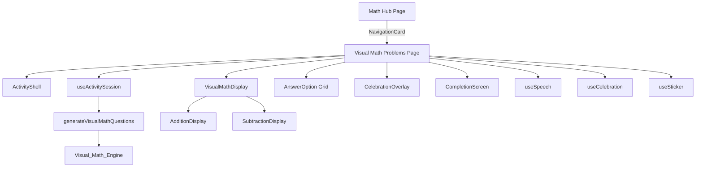

# Design Document: Visual Math Problems

## Overview

Visual Math Problems is a new activity within the math module of the kids' learning app. It teaches addition and subtraction through visual object representations — children see groups of familiar objects (emojis) and select the correct numerical answer from multiple choices.

The feature follows the same architecture as existing activities (Count Animals, Number Matching, Shape Hunt): a pure question generation engine (`features/math/visual-math-problems.ts`), a page component using the shared `ActivityShell`, `useActivitySession`, `useCelebration`, `useSpeech`, and `useSticker` hooks, and a dedicated visual display component for rendering the problem illustrations.

### Key Design Decisions

1. **Reuse existing infrastructure** — ActivityShell, useActivitySession, AnswerOption, CelebrationOverlay, CompletionScreen all apply directly. No new hooks needed.
2. **Separate Problem Display component** — A new `VisualMathDisplay` component handles the visual rendering of addition (two groups + plus sign) and subtraction (single row with crossed-out items). This is the primary new UI work.
3. **Pure generation function** — Like `count-animals.ts`, the engine is a pure function that produces `Question[]`. All randomness is injected through the existing `lib/random.ts` utilities, making it testable with property-based tests.
4. **Extended ActivityType union** — Add `'visual-math-problems'` to the `ActivityType` union in `types/activity.ts`.

## Architecture



### File Structure

```
features/math/visual-math-problems.ts        # Question generation engine
app/math/visual-math-problems/page.tsx        # Activity page component
components/activity/VisualMathDisplay.tsx      # Visual problem renderer
types/activity.ts                             # Updated ActivityType union
lib/constants.ts                              # New constants (OBJECT_TYPES)
```

## Components and Interfaces

### Visual_Math_Engine (`features/math/visual-math-problems.ts`)

The engine generates questions for visual math problems. It is a pure module with no side effects.

```typescript
interface MathProblem {
  operand1: number;
  operand2: number;
  operator: 'addition' | 'subtraction';
  correctAnswer: number;
  objectType: string; // emoji key from OBJECT_TYPES
}

function generateMathProblem(): MathProblem;
function generateDistractors(correctAnswer: number, count: number): number[];
function generateVisualMathQuestion(): Question;
function generateVisualMathQuestions(): Question[];
```

**Generation Rules:**
- Addition: operand1 ∈ [1,9], operand2 ∈ [1,9], sum ≤ 10
- Subtraction: minuend ∈ [2,10], subtrahend ∈ [1, minuend-1], difference ≥ 1
- Operator chosen with ~50/50 probability per question
- Object type randomly picked from OBJECT_TYPES (≥6 items)
- Distractors: 3 unique integers within ±3 of correct answer, clamped [0,10], expanding range if needed
- Batch size: QUESTIONS_PER_SESSION + 5
- No two consecutive questions share the same (operand1, operand2, operator) triple

### VisualMathDisplay Component

```typescript
interface VisualMathDisplayProps {
  operator: 'addition' | 'subtraction';
  operand1: number;
  operand2: number;
  objectEmoji: string;
}
```

**Addition rendering:**
- Left group: `operand1` emoji instances
- Plus symbol (+) centered between groups
- Right group: `operand2` emoji instances
- Each emoji ≥ 48×48px, groups separated by ≥ 16px from the operator

**Subtraction rendering:**
- Single row of `operand1` emoji instances (minuend)
- Rightmost `operand2` items rendered as Crossed_Out_Objects (50% opacity + diagonal strike)
- Minus (−) and equals (=) symbols below the row

### Activity Page (`app/math/visual-math-problems/page.tsx`)

Follows the same pattern as `count-animals/page.tsx`:
- Uses `useActivitySession('visual-math-problems', generateVisualMathQuestions)`
- Uses `useSpeech` with rate 0.8, pitch 1.1
- Uses `useCelebration` for correct answer feedback
- Uses `useSticker` to award sticker on completion
- Provides repeat-question button (hidden if speech unsupported)
- Calls `recordActivityCompletion` on session completion
- Back button navigates to `/math`

### Speech Text Format

- Addition: `"What is {operand1} plus {operand2}?"`
- Subtraction: `"What is {operand1} minus {operand2}?"`

### Constants Addition (`lib/constants.ts`)

```typescript
export const MATH_OBJECT_TYPES = [
  'apple', 'star', 'balloon', 'flower', 'fish', 'heart', 'cookie', 'butterfly'
] as const;

export const MATH_OBJECT_EMOJI_MAP: Record<string, string> = {
  apple: '🍎',
  star: '⭐',
  balloon: '🎈',
  flower: '🌸',
  fish: '🐟',
  heart: '❤️',
  cookie: '🍪',
  butterfly: '🦋',
};
```

## Data Models

### Extended ActivityType

```typescript
export type ActivityType =
  | 'count-animals'
  | 'number-matching'
  | 'shape-hunt'
  | 'letter-recognition'
  | 'beginning-sounds'
  | 'first-words'
  | 'visual-math-problems';  // NEW
```

### Question Structure (existing, reused)

The `Question` interface from `types/activity.ts` is reused as-is. The `prompt` field stores a human-readable string (e.g., "What is 3 + 4?"), and the `speechText` field stores the spoken version (e.g., "What is 3 plus 4?").

### Encoding Problem Data in Question

To allow the display component to render the visual representation, problem metadata is encoded in the question's `prompt` field using a structured format that the page component can parse:

```typescript
// The prompt is human-readable: "What is 3 + 2?"
// Additional metadata stored in the question id:
// Format: "visual-math-{operator}-{op1}-{op2}-{objectType}-{timestamp}-{rand}"
// Example: "visual-math-addition-3-2-apple-1700000000000-1234"
```

Alternatively, we extend the question with an optional `metadata` field:

```typescript
// Preferred approach: encode in question ID for parsing
// The page component extracts operator, operands, and objectType from the ID
```

**Decision:** Encode metadata in the question ID string. This avoids modifying the shared `Question` type while keeping all data accessible. The page component parses the ID to extract rendering parameters.

### Question ID Format

```
visual-math-{operator}-{operand1}-{operand2}-{objectType}-{timestamp}-{random}
```

Example: `visual-math-addition-3-4-star-1700000000000-5678`

The page component uses a parser function:

```typescript
interface ParsedMathQuestion {
  operator: 'addition' | 'subtraction';
  operand1: number;
  operand2: number;
  objectType: string;
}

function parseMathQuestionId(id: string): ParsedMathQuestion | null;
```


## Correctness Properties

*A property is a characteristic or behavior that should hold true across all valid executions of a system — essentially, a formal statement about what the system should do. Properties serve as the bridge between human-readable specifications and machine-verifiable correctness guarantees.*

### Property 1: Arithmetic constraints hold for all generated problems

*For any* generated math problem, if the operator is addition then operand1 ∈ [1,9], operand2 ∈ [1,9], and operand1 + operand2 ≤ 10; if the operator is subtraction then minuend ∈ [2,10], subtrahend ∈ [1, minuend-1], and difference ≥ 1.

**Validates: Requirements 1.1, 1.2**

### Property 2: Operator distribution is approximately balanced

*For any* generated batch of questions, the proportion of addition problems and subtraction problems each falls between 40% and 60% of the total batch size.

**Validates: Requirements 1.3**

### Property 3: Batch size is exactly QUESTIONS_PER_SESSION + 5

*For any* call to the batch generation function, the returned array length equals exactly QUESTIONS_PER_SESSION + 5.

**Validates: Requirements 1.4**

### Property 4: Object type is always from the valid set

*For any* generated question, the selected object type belongs to the predefined MATH_OBJECT_TYPES array.

**Validates: Requirements 1.5**

### Property 5: No consecutive duplicate problems

*For any* generated batch, no two consecutive questions share the same (operand1, operand2, operator) triple.

**Validates: Requirements 1.6**

### Property 6: Subtraction display arithmetic invariant

*For any* subtraction problem with minuend M and subtrahend S, the display renders exactly M total Object_Images, exactly S of which are crossed out, and exactly M − S of which are uncrossed.

**Validates: Requirements 3.1, 3.2, 3.5**

### Property 7: Answer options are well-formed

*For any* generated question, there are exactly 4 answer options, all with distinct values, and exactly one option's value equals the correct answer.

**Validates: Requirements 4.1, 4.2, 4.3**

### Property 8: Distractors are within valid range

*For any* generated question, all distractor values are integers in [0, 10].

**Validates: Requirements 4.4, 4.6**

### Property 9: Correct answer position varies across consecutive questions

*For any* generated batch of questions, the correct answer does not occupy the same option index for all consecutive pairs (i.e., position changes at least once in the batch).

**Validates: Requirements 4.5**

### Property 10: Score is monotonically non-decreasing

*For any* sequence of answer selections during a session, the correctCount value never decreases from one state to the next.

**Validates: Requirements 5.4**

### Property 11: Speech text matches operation format

*For any* generated question, if the operation is addition then speechText equals "What is {operand1} plus {operand2}?" and if the operation is subtraction then speechText equals "What is {operand1} minus {operand2}?"

**Validates: Requirements 6.2, 6.3**

## Error Handling

### Audio/Speech Unavailability
- If `speechSynthesis` is not supported, the page hides the repeat button and relies on visual text display only (Req 6.6).
- If audio playback fails, celebration and encouragement effects proceed with visual-only feedback (Req 5.5).
- The `useSpeech` hook already handles this via `isSpeechSupported()` check.

### Edge Cases in Problem Generation
- When the correct answer is near the boundaries (0, 1, 9, 10), the distractor generation expands the ±3 range iteratively until 3 unique distractors are found (Req 4.6).
- The batch generation retries or swaps questions to avoid consecutive duplicates (Req 1.6). If after maximum attempts a duplicate pair remains, it shuffles the batch.

### Session Interruption
- If the child navigates away mid-session, the component unmounts and state is discarded (inherent in React — no explicit cleanup needed). No progress is recorded (Req 8.5).

### Empty/Null Safety
- `parseMathQuestionId` returns `null` for malformed IDs; the page component falls back to a safe default rendering.
- All array accesses in the engine use guards to prevent out-of-bounds access.

## Testing Strategy

### Property-Based Tests (fast-check, ≥ 100 iterations each)

Property-based tests validate the universal correctness properties defined above. They use the `fast-check` library (already in devDependencies) with Vitest.

**File:** `features/math/visual-math-problems.pbt.test.ts`

Each test references its design property:
- **Feature: visual-math-problems, Property 1**: Arithmetic constraints
- **Feature: visual-math-problems, Property 2**: Operator distribution
- **Feature: visual-math-problems, Property 3**: Batch size
- **Feature: visual-math-problems, Property 4**: Valid object type
- **Feature: visual-math-problems, Property 5**: No consecutive duplicates
- **Feature: visual-math-problems, Property 7**: Answer options well-formed
- **Feature: visual-math-problems, Property 8**: Distractors in range
- **Feature: visual-math-problems, Property 9**: Correct answer position varies
- **Feature: visual-math-problems, Property 11**: Speech text format

**File:** `components/activity/VisualMathDisplay.pbt.test.tsx`
- **Feature: visual-math-problems, Property 6**: Subtraction display invariant

**File:** `hooks/useActivitySession.pbt.test.ts` (existing — Property 10 is already covered)
- **Feature: visual-math-problems, Property 10**: Score monotonically non-decreasing

Configuration:
- Minimum 100 iterations per property (`{ numRuns: 200 }` to match project convention)
- Use `fc.constant(null)` for generation-based tests (engine uses internal randomness)
- Use `fc.integer()` arbitraries for parameterized tests where operands are controlled

### Unit Tests (example-based)

**File:** `features/math/visual-math-problems.test.ts`
- Specific examples for addition/subtraction generation
- Edge cases: boundary operands, distractor expansion at range limits

**File:** `components/activity/VisualMathDisplay.test.tsx`
- Addition renders correct number of emojis in both groups
- Plus symbol present between groups
- Subtraction renders crossed-out styling (opacity + strike-through)
- Minus and equals symbols present
- Minimum 48×48px size via CSS classes
- aria-label present with correct text

**File:** `app/math/visual-math-problems/page.test.tsx`
- Speech synthesis called on question display
- Celebration overlay on correct answer
- Incorrect answer marking without revealing correct answer
- Progress bar shows correct values
- Back button href is `/math`
- CompletionScreen renders on session complete
- Repeat button hidden when speech unsupported
- recordActivityCompletion called on completion

### Integration Tests

- Math hub page includes NavigationCard for visual-math-problems
- ActivityType union accepts 'visual-math-problems' (compile-time check)
- Full session flow: answer all questions → CompletionScreen → sticker awarded
